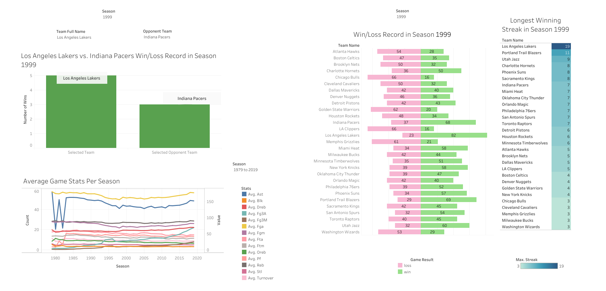
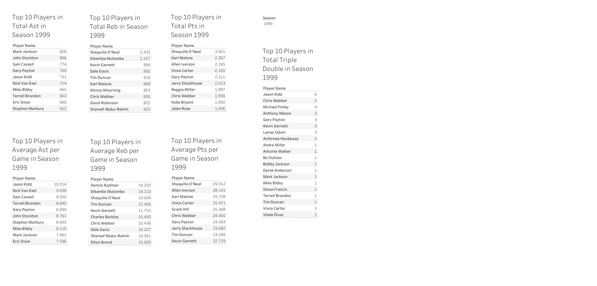
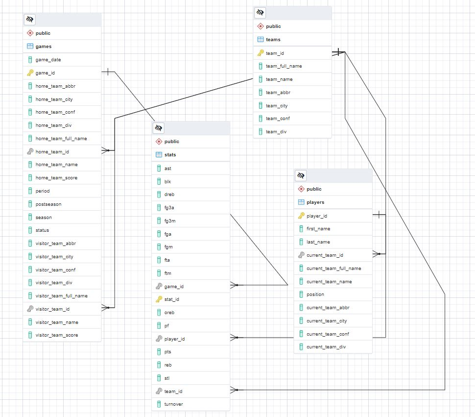

# NBA Data Visualization

**Summary**
---
In This project I attempt to retrieve all NBA-related data such as players, teams, games, game statistics since the 1979 season. Data is collected from the free API at https://www.balldontlie.io/#introduction. The API is constantly updated with current game data up to and including the current 2021 season. For this project, I will focus on seasons 1979 through 2019. I use Python to extract data from the API, clean the data and insert the data into a PostgreSQL database. Once all data is stored in the PostgreSQL database, I perform various queries from the database and import the results to Tableau Public to create an interactive dashboard.

**Tableau Dashboard**
---
Please check out the dashboard at https://public.tableau.com/views/NBADashboard_16444836938170/Dashboard1TeamStatistics?:language=en-US&:display_count=n&:origin=viz_share_link

* Here are some screenshots

**Step 1: Data Preparation**
---
* [data_preparation.py](https://github.com/RonaldLi-GitHub/NBA_Data_Visualization/blob/main/data_preparation.py) contains the code for this section
* The free API is at https://www.balldontlie.io/#introduction
* The script retrieves data from the following 4 sections
  * Players-all players with attributes such as name, player id, current team or last team for players who are retired
  * Teams-all teams with attributes such as team id, team name, city, conference, division
  * Games-all games with one record per game, each record contains game id, season, home team, visitor team, scores
  * Stats-all stats for all games with one record per stat per player, each record contains stat id, player id, team id, game id, ast, reb, pts and other stats
* Each section of data is of json format. The json files are then converted and stored in a dataframe. Player, Team, Game data are exported to csv files. Stat data is exported to a pickle file due to its size

**Step 2: Set up PostgreSQL Database and Create Tables**
---
* [create_tables.py](https://github.com/RonaldLi-GitHub/NBA_Data_Visualization/blob/main/create_tables.py) contains the code for this section
* For this project, I create a PostgreSQL Database locally using pgAdmin 4. After creating the database, I recorded the hostname/database/username/port_id
* I create a table for each of Players/Teams/Games/Stats, each with its primary id and/or foreign id
* The ERD diagram is the following
 
 
**Step 3: Insert Data into PostgreSQL Database**
---
* [insert_data.py](https://github.com/RonaldLi-GitHub/NBA_Data_Visualization/blob/main/insert_data.py) contains the code for this section
* This section inserts Players/Teams/Games/Stats dataframes into the cooresponding table in the database

**Step 4: Perform SQL Queries for Data Visualization**
---
* [queries_for_visualization.sql](https://github.com/RonaldLi-GitHub/NBA_Data_Visualization/blob/main/queries_for_visualization.sql) contains the queries used for the Tableau dashboard
* 
